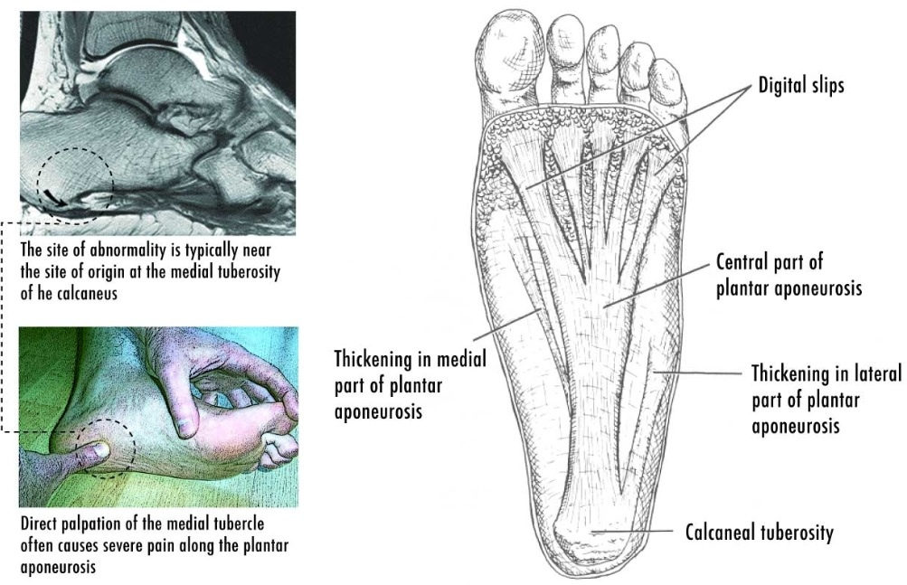

Mo plantar facitis protocol
Plantar fasciitis is very painful and is often caused due to too much running or strenuous activity. (Young et al, 2001) describe the pain is "usually caused by collagen degeneration at the origin of the plantar fascia at the medial tubercle of the calcaneus" and a visual diagram is shown in Figure 1. The role of the plantar fascia is for foot arch support.
 

The content provided in this blog post is for informational and educational purposes only and is not intended as a substitute for professional medical advice, diagnosis, or treatment. Always seek the advice of your physician or other qualified health provider with any questions you may have regarding a medical condition. Never disregard professional medical advice or delay seeking it because of something you have read on this website. The author and publisher of this blog are not medical professionals and do not claim to be. Reliance on any information provided in this post is solely at your own risk.

Treatment protocol based on research
This protocol is a long protocol that will have to become part of ones daily routine

Stretching & Strengthening
My line manager recommended stretching. (Young et al, 2001) provide figures as shown below of stretches to do (Figures 2-8). Stretching the calves can help loosen the plantar fascia as well as help strengthen it. Doing things such as Dynamic stretching and massaging the plantar fascia can help remove scar tissue and build the connective tissue.

Shoes
Consider buying flat feet or high arch feet shoes. If you have flat feet arch taping and buying arch supports can help with flare ups.

You may also want to consider using night splints which are designed to keep your ankle up overnight. This is to prevent the plantar from being flexed while sleeping (as shown in Figure 9) 

References
Young, C.C., Rutherford, D.S. and Niedfeldt, M.W. (2001) Treatment of plantar fasciitis. https://www.aafp.org/pubs/afp/issues/2001/0201/p467.html.