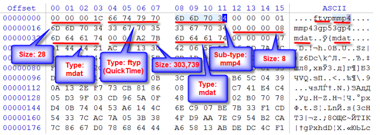

# Introduction 
One of the best things about looking handsome is that I can make videos of my face, upload it to tiktok and consider it valuable content to society. Also the thumbnail image is AI generated but it looks so cool. If you also know me, you know I like coding and learning and recently I learnt about polyglot files. In this blobpost, we'll see how a video of me can be a zip file, mp4 file and maybe in the future I'll update this page so it's also a pdf file. 

<iframe width="560" height="315" src="https://www.youtube.com/embed/eBEnq2tl1Xc?si=IhgNsTO4RyTxfpok" title="YouTube video player" frameborder="0" allow="accelerometer; autoplay; clipboard-write; encrypted-media; gyroscope; picture-in-picture; web-share" referrerpolicy="strict-origin-when-cross-origin" allowfullscreen></iframe>

# Technical stuff
The way an app figures out a file type isn't always by the file extension rather the magic bytes in the file. Below is some text and image I stole from a website 
File sub-type is mmp4 (hex: 6D 6D 70 34) which points to MP4 file type. First block size is 28 (hex: 00 00 00 1C, big-endian, high byte first), size located at offset 0.

At offset 28 (hex: 1C) is located the second chunk, which has a size of 8 and type mdat (hex: 6D 64 61 74).

The next chunk is located at offset 28+8=36 (hex: 24) and has a size 303,739 (hex: 00 04 A2 7B) and type mdat (hex: 6D 64 61 74) at offset 40 (hex: 28).

The next chunk is located at offset 36 + 303,739=303,775 and has a size 6,202 (hex: 00 00 18 3A) and type moov (hex: 6D 6F 6F 76) at offset 303,779.

This is the last chunk, so total file size is 303,775+6,202=309,977 bytes.

 